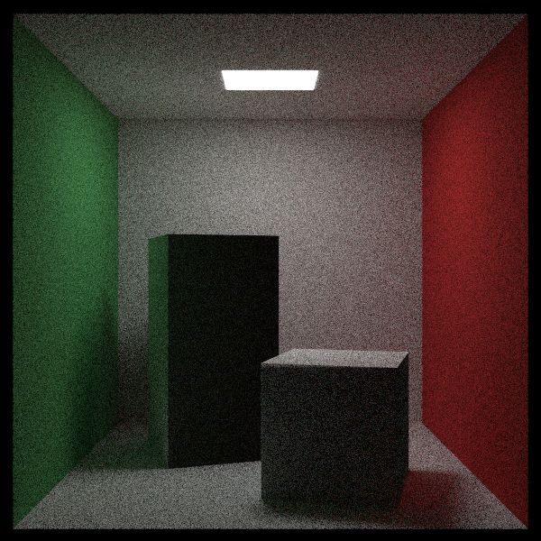

**Where's the idea of this project from?**

[PPCA 2021 raytracer-tutorial](https://github.com/aik2mlj/raytracer-tutorial)

[RayTracing in One Weekend Series](https://raytracing.github.io/)

**Tasks to be Completed**

- [x] book1
- [x] book2 except for a few parts including BVH
- [ ] concurrency

**Some pictures**

